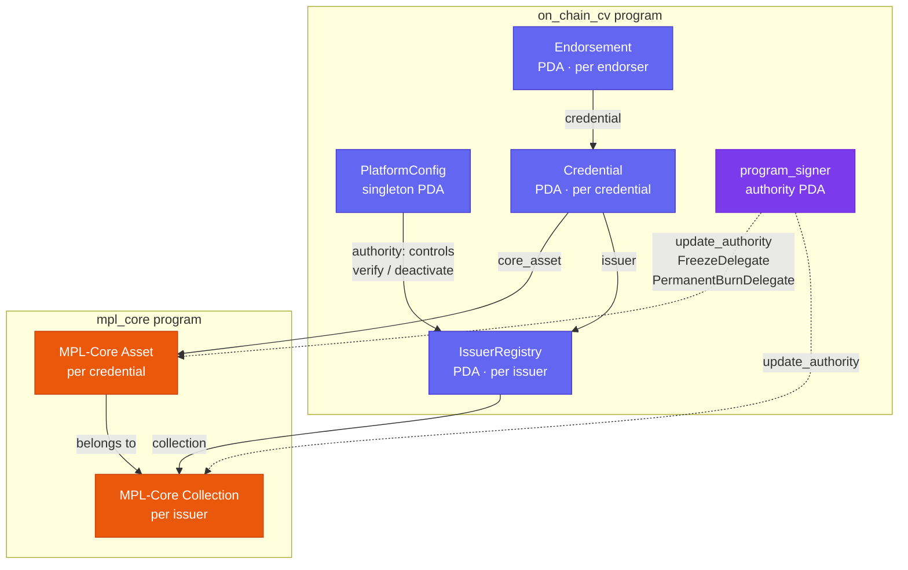

# OnChainCV

A Solana program that lets employers and universities issue verifiable credentials on-chain. Each credential is an Anchor PDA and an MPL-Core soulbound NFT, linked to each other. When an issuer revokes one, the NFT burns and disappears from the recipient's wallet in the same transaction.

A recruiter asks a candidate whether they worked at Company X. The candidate shares a link. The recruiter sees the credential, signed by Company X's verified wallet. No PDF to fake, no email to forge.

## Live Demo

**[onchaincv.app/profile/\<pubkey\>](https://on-chain-cv-delta.vercel.app/profile/Fkqo4vWFpdzKM8qmStW8FPMhCCACnW9Zve7LpcLKyr8N)** — candidate portfolio, open in incognito.

**[onchaincv.app/credential/\<pda\>](https://on-chain-cv-delta.vercel.app/credential/EGHvfB7AGN9MJ5rPotC1HqFTp1vRAVzBGBbEZGjkX9wv)** — single credential with verify badge and QR code.

| | |
|---|---|
| Solana Explorer | [Program account](https://explorer.solana.com/address/4YDMjUyfuj4efEbyceNknSjwuFzxR1yZJSi6fzKsCH52?cluster=devnet) |
| Devnet cluster | `https://api.devnet.solana.com` |
| Program ID | `4YDMjUyfuj4efEbyceNknSjwuFzxR1yZJSi6fzKsCH52` |

## How it works

Issuers (companies, universities) register on the platform and, after admin approval, get an MPL-Core Collection where all their credentials live. Recipients hold the soulbound NFTs in their wallets. The platform admin verifies issuers and can suspend them: suspension blocks new issuances but doesn't touch credentials already issued.

The `program_signer` PDA (`seeds: [b"program_signer"]`) is the `update_authority` for all MPL-Core Collections and Assets. Nobody outside the program can alter asset metadata or call CPI burns.

## Frontend pages

All pages run at `https://on-chain-cv-delta.vercel.app` in dev mode.

| Route | Who uses it | What it does |
|---|---|---|
| [`/`](https://on-chain-cv-delta.vercel.app) | anyone | Landing: explains what the platform does, links to admin setup |
| [`/admin`](https://on-chain-cv-delta.vercel.app/admin) | platform admin | Initialize the platform, verify/deactivate issuers, upload collection metadata to Arweave, transfer admin key to a new wallet |
| [`/issuer/register`](https://on-chain-cv-delta.vercel.app/issuer/register) | issuer | Submit name and website; creates the `IssuerRegistry` PDA, status becomes "pending verification" |
| [`/issuers`](https://on-chain-cv-delta.vercel.app/issuers) | anyone | Browse all registered issuers; shows verification status and credentials issued count |
| [`/issuer/[pda]`](https://on-chain-cv-delta.vercel.app/issuer/ABC123) | anyone | Public issuer profile: name, website, verification timestamp, link to their MPL-Core Collection |
| [`/dashboard`](https://on-chain-cv-delta.vercel.app/dashboard) | issuer | Issue credentials (uploads metadata to Arweave/Irys, mints soulbound NFT), revoke credentials (burns the NFT), close revoked credentials to reclaim rent |
| [`/profile/[pubkey]`](https://on-chain-cv-delta.vercel.app/profile/ABC123) | anyone | Candidate's public portfolio: all credentials issued to that wallet, color-coded by category (Work / Education / Certificate / Achievement), expiry and revocation status |
| [`/credential/[pda]`](https://on-chain-cv-delta.vercel.app/credential/ABC123) | anyone | Single credential: verify badge (valid / revoked / expired / issuer unverified / tampered), endorsement list, QR code for printing in a physical CV, Endorse button for connected wallets |
| [`/my-endorsements`](https://on-chain-cv-delta.vercel.app/my-endorsements) | endorser | List of your active endorsements, countdown to when each 30-day lockup ends, Close button to reclaim locked SOL |

## On-chain accounts

### PlatformConfig

**Type:** Anchor `#[account]` PDA · owned by `on_chain_cv` · singleton

Seeds: `[b"platform_config"]`. Created once at deploy; calling it a second time fails with `AccountAlreadyInUse`.

| Field | Type | Description |
|---|---|---|
| `authority` | `Pubkey` | Current platform admin. Only this wallet can call `verify_issuer`, `deactivate_issuer`, and `transfer_platform_authority`. |
| `bump` | `u8` | Avoids recomputing `find_program_address` on every instruction. |

The account's existence means the platform is initialized. There's no active/inactive flag.

---

### IssuerRegistry

**Type:** Anchor `#[account]` PDA · owned by `on_chain_cv` · one per issuer wallet

Seeds: `[b"issuer_registry", authority]`. One per issuer wallet: the authority key in the seed makes duplicate registration impossible.

| Field | Type | Description |
|---|---|---|
| `authority` | `Pubkey` | Wallet that controls this registry. Can call `update_issuer_metadata` and `issue_credential`. |
| `name` | `String` (max 64) | Organization display name. Used as the prefix for the MPL-Core Collection: `"{name} Credentials"`. Changing it resets `is_verified`. |
| `website` | `String` (max 128) | Display only. |
| `is_verified` | `bool` | `false` after `register_issuer`. Set to `true` by `verify_issuer`. Reset to `false` if `name` changes. `issue_credential` fails while this is `false`. |
| `verified_by` | `Option<Pubkey>` | Admin wallet that ran the last verification. `None` before first verification. |
| `verified_at` | `Option<i64>` | Unix timestamp of verification. `None` before first verification. |
| `deactivated_at` | `Option<i64>` | Set by `deactivate_issuer`. When `Some`, new credentials are blocked; existing ones are untouched. Deactivated issuers keep revocation power. |
| `collection` | `Option<Pubkey>` | Address of the MPL-Core Collection created at first verification. All credential assets belong to it. `None` before first verification. |
| `credentials_issued` | `u64` | Counter used as part of the `Credential` PDA seed at issuance time, then incremented. Transaction atomicity guarantees no collisions. |
| `bump` | `u8` | Cached PDA bump. |

Lifecycle: `register_issuer` → `verify_issuer` → (optional) `deactivate_issuer` → `verify_issuer` again to reactivate.

---

### Credential

**Type:** Anchor `#[account]` PDA · owned by `on_chain_cv` · one per issued credential

Seeds: `[b"credential", issuer_registry, recipient, index_le_bytes]`. One per issued credential. The `index` is the value of `credentials_issued` at issuance time, stored in the account so the PDA can be re-derived later without querying the registry.

| Field | Type | Description |
|---|---|---|
| `issuer` | `Pubkey` | `IssuerRegistry` PDA of the issuer. |
| `recipient` | `Pubkey` | Wallet that received the credential. |
| `core_asset` | `Pubkey` | Address of the MPL-Core Asset minted alongside this PDA. Bidirectional link: the asset's metadata points back to this PDA. |
| `skill` | `SkillCategory` | `Work`, `Education`, `Certificate`, or `Achievement`. Serialized as a single byte (enum variant index). |
| `level` | `u8` | Proficiency level, 1–5. Validated in the handler before the account is written. |
| `issued_at` | `i64` | Unix timestamp of issuance. |
| `expires_at` | `Option<i64>` | Optional expiry. When `Some` and in the past, the credential is considered expired. The program doesn't block actions on expired credentials — expiry is checked off-chain. |
| `revoked` | `bool` | Set to `true` by `revoke_credential`. The MPL-Core Asset is burned in the same transaction. |
| `revoked_at` | `Option<i64>` | Timestamp of revocation. `None` while active. |
| `endorsement_count` | `u32` | Number of live `Endorsement` PDAs referencing this credential. Must be `0` before `close_credential` can run. |
| `metadata_uri` | `String` (max 200) | Arweave URI (`ar://`, `https://arweave.net/`, or `https://gateway.irys.xyz/`). The program rejects all other prefixes. |
| `index` | `u64` | Snapshot of `credentials_issued` at issuance. Stored so the PDA can be re-derived without reading the current registry state. |
| `bump` | `u8` | Cached PDA bump. |

After `revoke_credential` the Credential PDA stays alive for audit history. `close_credential` removes it and returns rent to the issuer, but only once `endorsement_count` reaches zero.

---

### Endorsement

**Type:** Anchor `#[account]` PDA · owned by `on_chain_cv` · one per endorser per credential

Seeds: `[b"endorsement", credential, endorser]`. One per endorser per credential. Anchor's `init` will fail if the account already exists, so double-endorsing needs no handler check.

| Field | Type | Description |
|---|---|---|
| `credential` | `Pubkey` | The `Credential` PDA being endorsed. |
| `endorser` | `Pubkey` | Wallet that created the endorsement. Rent returns here on `close_endorsement`. Cannot equal `credential.recipient`: self-endorsement is rejected at the constraint level, not in the handler. |
| `endorsed_at` | `i64` | Unix timestamp of creation. The 30-day lockup countdown starts here. |
| `bump` | `u8` | Cached PDA bump. |

The endorser pays ~0.002 SOL in rent when creating the account. That SOL is locked for 30 days, then `close_endorsement` returns it. The lockup is what makes Sybil attacks costly: a hundred fake endorsements means a hundred wallets each sitting on locked SOL for a month.

## Account relationships

The four program accounts reference each other and two external MPL-Core account types (owned by the `mpl_core` program, created via CPI).



Solid arrows — data references stored in account fields. Dotted arrows — authority roles held by `program_signer` over MPL-Core accounts.

### Outgoing references

| From | Field | To | Type of target | Relationship |
|---|---|---|---|---|
| `IssuerRegistry` | `collection` | MPL-Core Collection | `mpl_core` account | Created by `verify_issuer` on first approval. Groups all credential assets from this issuer under the name `"{name} Credentials"`. `None` before first verification. Renaming the issuer syncs the collection name via `UpdateCollectionV1` CPI. |
| `Credential` | `issuer` | `IssuerRegistry` | Anchor PDA | The registry that issued this credential. Part of the PDA seeds and used by `revoke_credential` and `close_credential` to check that only the correct issuer can act. |
| `Credential` | `core_asset` | MPL-Core Asset | `mpl_core` account | Soulbound NFT minted in the same transaction as this PDA. After `revoke_credential` burns the asset, this field remains as an immutable record of which asset existed. |
| `Endorsement` | `credential` | `Credential` | Anchor PDA | The credential being endorsed. `close_endorsement` reads this to decrement `Credential.endorsement_count`. |

### Incoming references (what points at each account)

| Account | Referenced by | Via field | Why |
|---|---|---|---|
| `IssuerRegistry` | `Credential` | `Credential.issuer` | Authorizes `revoke_credential` and `close_credential`; part of `Credential` PDA seeds |
| MPL-Core Collection | `IssuerRegistry` | `IssuerRegistry.collection` | Required in `issue_credential` and `revoke_credential` CPIs to scope the asset to the correct issuer |
| `Credential` | `Endorsement` | `Endorsement.credential` | Links the endorsement to what it vouches for; `Credential.endorsement_count` tracks the number of live `Endorsement` accounts |
| MPL-Core Asset | `Credential` | `Credential.core_asset` | Identified for burning in `revoke_credential` |

### Authority over MPL-Core accounts

All MPL-Core Collections and Assets created by this program have `program_signer` PDA (`seeds: [b"program_signer"]`) as their authority. There is no instruction to transfer this authority elsewhere.

| Authority role | Held by | Effect |
|---|---|---|
| `update_authority` on Collection | `program_signer` | Only the program can rename the collection via `UpdateCollectionV1` CPI |
| `update_authority` on Asset | `program_signer` | Only the program can change asset metadata — issuers cannot alter credentials post-issuance |
| `FreezeDelegate` authority on Asset | `program_signer` | Only the program can freeze or unfreeze the asset — recipients cannot transfer it |
| `PermanentBurnDelegate` authority on Asset | `program_signer` | Only the program can burn the asset — enables `revoke_credential` without a separate unfreeze step |

## Instructions

```
initialize_platform                                    one-time setup
transfer_platform_authority                            hand admin key to a new wallet
register_issuer(name, website)                         any wallet registers as a candidate issuer
verify_issuer(collection_uri)                          admin approves; creates MPL-Core Collection
deactivate_issuer                                      suspend new issuances (existing credentials stay)
update_issuer_metadata(name, website)                  renaming resets is_verified
issue_credential(skill, level, name, expires_at, uri)  creates Credential PDA + soulbound NFT
revoke_credential                                      burns the NFT, marks credential revoked
endorse_credential                                     third-party endorsement with 30-day SOL lockup
close_endorsement                                      reclaim locked SOL after 30 days
close_credential                                       clean up a revoked PDA after all endorsements close
```

## Soulbound mechanics

Assets are created with two MPL-Core plugins, both controlled by `program_signer`:

- `FreezeDelegate { frozen: true }` — recipients cannot transfer or list the NFT
- `PermanentBurnDelegate` — the issuer can burn a frozen asset without unfreezing it first

`PermanentBurnDelegate` uses `forceApprove` semantics that bypass `FreezeDelegate.frozen`, so `revoke_credential` calls `BurnV1` directly with no separate unfreeze step.

## Metadata storage

All URIs must be Arweave: `ar://...`, `https://arweave.net/...`, or `https://gateway.irys.xyz/...`. The program rejects anything else before any account is written. HTTP servers go offline; Arweave is permanent.

## Endorsements

Anyone can endorse a credential, except the recipient. Endorsing locks about 0.002 SOL for 30 days. After that, `close_endorsement` returns it.

Closing a revoked credential requires `endorsement_count == 0`. Endorsers close their PDAs first, then the issuer closes the credential. This prevents dangling references in a chain that can't garbage-collect on its own.

## Getting started

Prerequisites: Rust + Anchor CLI, Node.js 18+, Yarn, Solana CLI.

### Localnet

```bash
# Tests embed the compiled .so at compile time
anchor build
cargo test

# Frontend
cd app && npm run dev
```

Point Phantom at localnet (`http://localhost:8899`) and open `https://on-chain-cv-delta.vercel.app/admin` to initialize the platform.

### Devnet (live)

The program is deployed to Solana Devnet. To run the frontend against it locally:

```bash
cd app
echo "NEXT_PUBLIC_RPC_ENDPOINT=https://api.devnet.solana.com" > .env.local
npm run dev
```

Switch Phantom to Devnet before connecting.

## Project structure

```
programs/on-chain-cv/src/
├── lib.rs           entry point, instruction routing
├── state.rs         account structs and events
├── instructions.rs  all handlers in one flat file
├── constants.rs     PDA seeds, allowed URI prefixes
└── error.rs         custom error codes

programs/on-chain-cv/tests/
├── test_initialize.rs      platform init and authority transfer
├── test_issuer.rs          register, verify, deactivate, update
├── test_credential.rs      issue and revoke
├── test_endorsement.rs     endorse and close
├── test_full_lifecycle.rs  end-to-end flow
├── test_unauthorized.rs    everything the program should reject
├── test_metadata_tampering.rs
└── test_rename_sync.rs     collection name stays in sync on rename

app/src/
├── app/admin/                 platform admin UI
├── app/issuer/register/       register as an issuer
├── app/issuer/[pda]/          issuer public profile
├── app/issuers/               list of all issuers
├── app/profile/[pubkey]/      candidate credential portfolio
├── app/credential/[pda]/      single credential with verify badge
├── app/dashboard/             issue, revoke, and close credentials
└── app/my-endorsements/       endorser history
```

## Why `instructions.rs` is a single flat file

Anchor generates `__client_accounts_*` symbols for every `#[derive(Accounts)]` struct. When instructions live in submodules and get glob-re-exported, those symbols collide and the crate won't compile. A flat file sidesteps this.

## Frontend note

The client doesn't use `@coral-xyz/anchor`. `app/src/lib/program.ts` builds instructions manually: raw discriminator bytes from the IDL, a hand-written Borsh encoder, and custom account readers that mirror Rust struct layout field by field. This keeps the browser bundle small but means `program.ts` needs updating whenever an account struct changes in `state.rs`.

## Tests

LiteSVM runs tests in-process with no `solana-test-validator`. The compiled `.so` is embedded at compile time via `include_bytes!`, so running tests requires a prior `anchor build`. Each test calls `setup()` for a fresh VM instance; there's no shared state between tests. `test_unauthorized.rs` and `test_metadata_tampering.rs` focus on what the program rejects, not just the happy path.

---

[Русская версия](README.ru.md)
